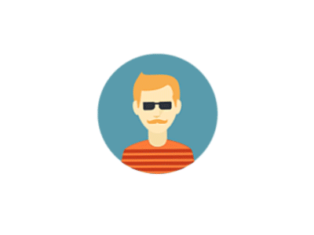

    

        
        

            <marquee style="
            color: #121212;
            font-weight: bold">Projeto PLP</marquee>
            <h3 style="border-bottom: 2px solid #0c116b;
                color: #0c116b;">UFCG</h3>
        

    

    Bem-vindo ao Fliperama em Haskell! Este fliperama baseado em terminal oferece uma coleção de atividades divertidas para desfrutar diretamente da sua linha de comando. Com uma variedade de jogos e recursos interativos, com certeza irá mantê-lo entretido por horas.

# Fliperama em Haskell
### * Recursos

<h1 style="color: #222222;">Gerenciamento de usuários</h1>

    
    
    
        Gerencie sua experiência no fliperama com facilidade! Crie seu próprio perfil de usuário, acompanhe suas pontuações altas e compita com amigos pelo topo do ranking.        
    

### Gerenciamento de Usuários

<h1 style="color: #222222;">Tetris</h1>

    
    
    
        Experimente o clássico jogo de quebra-cabeça diretamente no seu terminal! Teste suas habilidades ao posicionar estrategicamente os blocos para limpar linhas e acumular pontos. Com múltiplos níveis de dificuldade, é divertido para jogadores de todas as idades.
    

<h1 style="color: #222222;">FMCC</h1>

    
    
    
        Embarque em uma aventura épica no modo de jogo de FMCC! Explore descubra tesouros escondidos enquanto viaja por um mundo de FMCCII. 
    

## Como Jogar

1. **Gerenciamento de Usuários**: Comece criando seu próprio perfil de usuário usando as opções fornecidas. Uma vez registrado, você pode fazer login para acessar seu perfil e acompanhar seu progresso.
Uma vez logado:
2. **Tetris**: Entre no modo de jogo Tetris para começar a jogar. Use as setas do teclado para mover e girar os blocos que caem e tente completar linhas para marcar pontos. Limpe o maior número de linhas possível antes que os blocos alcancem o topo!

3. **Jogo de FMCC**: Selecione o modo de jogo FMCC para embarcar em uma aventura emocionante. Suas escolhas irão moldar o desfecho da história!